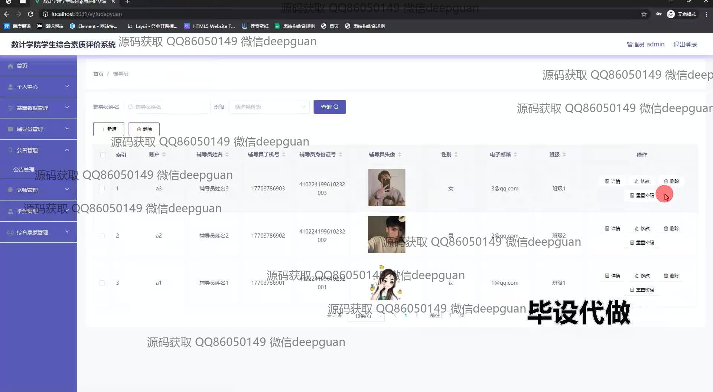

<h1 align="center">数计学院学生综合素质评价系统的设计与开发</h1>

## 简介
数计学院学生综合素质评价系统：角色分为学生、管理员、教师和考评委员会；提供学生信息管理、成绩录入与查询、综合素质评分、公告与留言管理，提高管理效率和信息透明度。    --计算机毕业设计源码；毕设源码；java毕业设计源码

## 联系方式

<h3 align="center">获取完整代码与数据库文件 + 微信：deepguan QQ: 86050149 QQ群: 783742310</h3>

<h3 align="center">可帮忙远程部署 包运行成功！提供远程部署、修改代码、设计文档指导、代码讲解等服务！</h3>

## 功能介绍（完整见运行截图）
教师： 教师在系统中可以进行学生综合素质的评价管理，查看学生的基本信息、综合素质评分以及详细的评价指标得分。教师能够进行学生信息的管理和查询，涵盖学生的学业成绩、课外活动、社会实践等多方面数据。此外，教师可以管理公告，查看和回复学生的留言，进行专业综合评分与思想道德评估，以促进学生的全面发展。教师可以通过个人中心进行密码修改，并在必要时退出登录。

学生： 学生在系统中可以查看个人的基本信息、学业成绩、及各项综合素质评分，包括思想道德水平、身心健康、社会实践和艺术素养等指标。学生可以访问个人中心修改密码，并通过留言模块与教师沟通反馈。系统支持学生注册与登录，确保学生可以依据不同角色访问相应权限的模块。学生可通过系统提交材料，并在需要时切换角色或退出登录。

管理员： 管理员在系统中负责全局的用户与数据管理，包括对公告管理、老师管理、学生管理和留言管理等模块进行全面操控。管理员可以进行用户角色的设置和权限分配，以及对各种信息的增删改查操作。管理员还可以通过查看数据统计与分析，为学院的各项决策提供依据。此外，管理员可使用公告管理功能为学生和教师发布重要通知，以保持信息的透明度和及时性。

考评委员会： 考评委员会在系统中负责制定并监督综合素质评价标准，审查并反馈学生的综合素质表现情况。通过查看详细的评分列表和指标，考评委员会可以对学生的整体发展做出评估和建议。系统让考评委员能够在不同专业和评分维度上进行深入分析，从而为提高学院的教学质量和学生的素质培养总体策略提供基础。考评委员会也能参与公告管理以确保所有参与者获得最新的政策和规则信息。

## 运行截图

本代码来源于网络,仅供学习参考使用!

